## New Alpha Release Available: [Version 0.9.2.0](https://github.com/dotslashsoft/caspian-surveyor/releases/tag/v0.9.2.0)

# Caspian Surveyor

**An exploration companion for Elite Dangerous.**

## What is Caspian Surveyor?

Caspian Surveyor is an exploration companion for Elite Dangerous built to turn raw journal data into a persistent, readable record of your journey. It monitors the Elite Dangerous journal in real time, maintains exploration history across sessions, and presents current system data through an in-game HUD-style overlay.

The project aims to improve the exploration experience for the Elite Dangerous community by providing quality-of-life tools and contributing to a more satisfying exploration gameplay loop.

## Current Alpha Status / Version

Development of Caspian Surveyor is active and ongoing.

**Current Version:** 0.9.2.0

## Screenshots

### Default HUD Panel


### Planetary Body Information

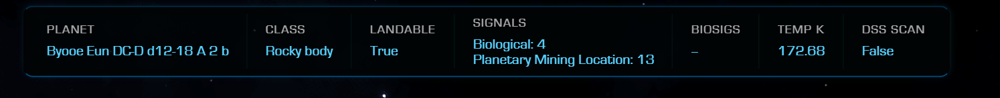

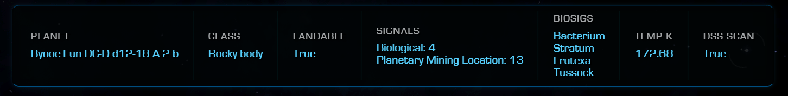

### Exobiology Information


***Exobiology Panel - pre-exobio scan***
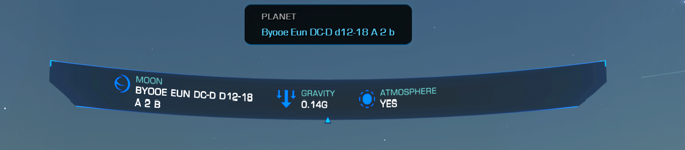

***Exobiology Panel - post-exobio scan #1***
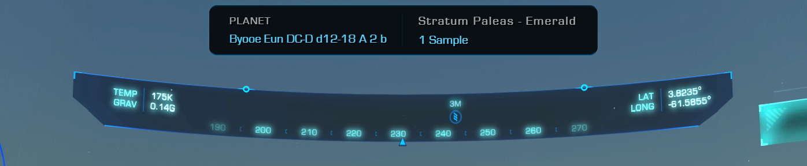

***Exobiology Panel - post-exobio scan #2***
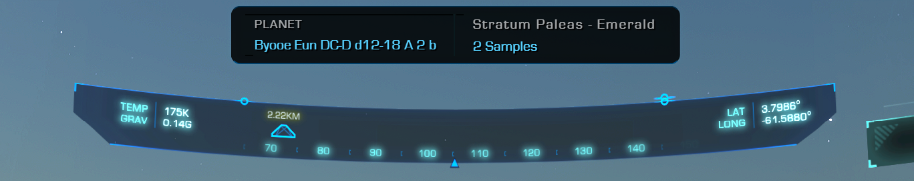

***Exobiology Panel - post-exobio scan #3 - Analysed and Logged***
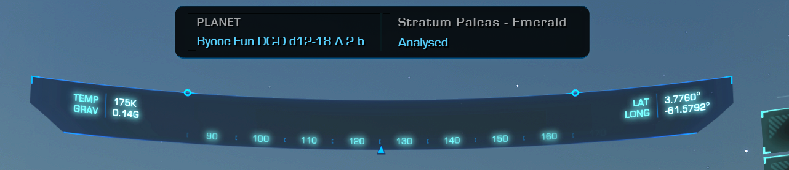

***Exobiology Panel - post-exobio scan - two genus species variants***
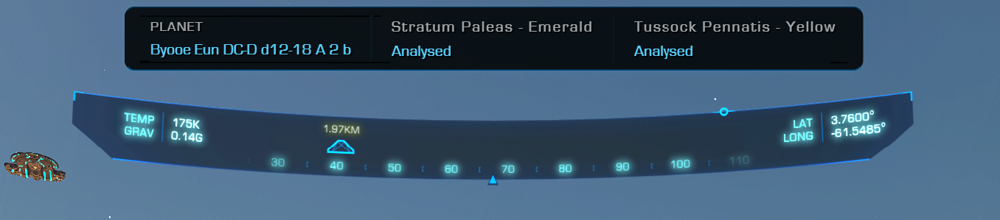

***Exobiology Panel - post-exobio scan - four genus species variants***
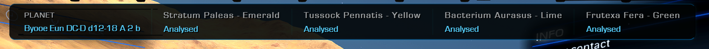

### Orbital and Physical Information


### Orbital / Physical Data Legend

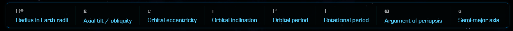

### In-Cockpit View

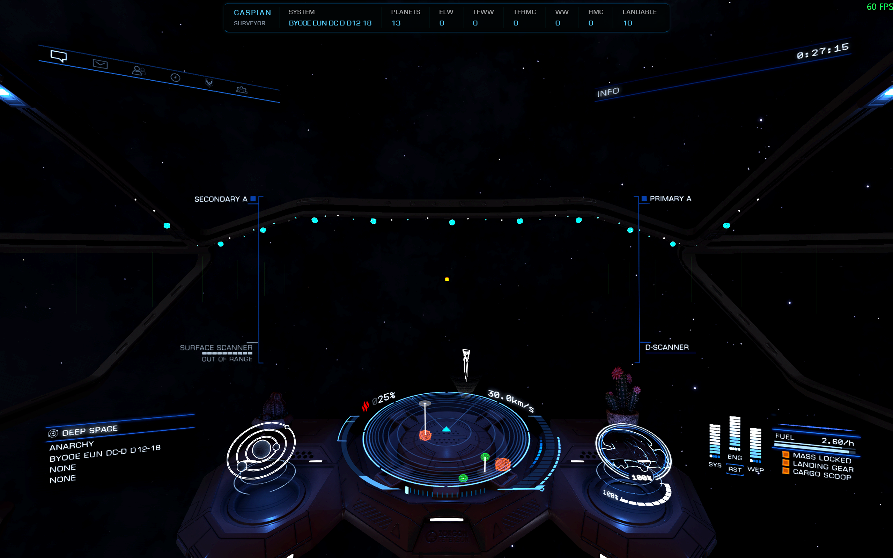

## Installation

1. Download `CaspianSurveyor-0.9.2.0-Setup.exe` from the GitHub Releases page.

2. Because the installer is currently unsigned, Microsoft Edge or another browser may warn that the file is not commonly downloaded. Keep the file **only if you downloaded it from the official Caspian Surveyor GitHub release page**.

   In Microsoft Edge:
   - Open the download menu and choose **Keep**.
   - When prompted to confirm, choose **Keep anyway**.

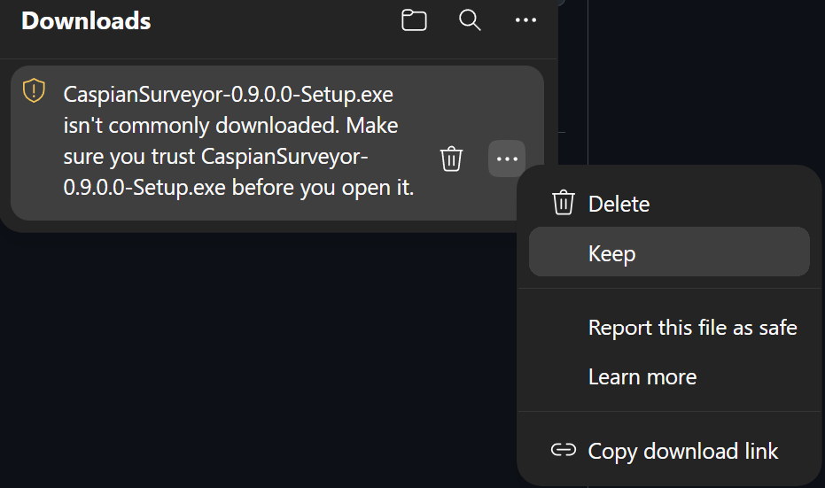 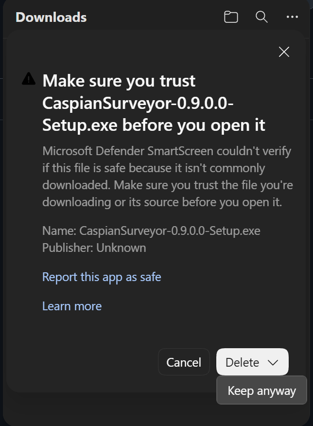

3. Run the installer. Administrator privileges are not required.

4. Windows may display an **Unknown Publisher** or **Microsoft Defender SmartScreen** warning when the installer is launched.

   If Windows displays **Windows protected your PC**, select **More info** → **Run anyway** if you trust the file source.

## How to Use Caspian Surveyor

1. Launch Caspian Surveyor.
2. Launch Elite Dangerous.

   **Note:** A new Elite Dangerous journal is created approximately 10–15 seconds after reaching the main menu. Once the new journal is detected, Caspian Surveyor will begin populating the HUD data panels.

3. Caspian Surveyor was built to be minimally invasive. Program interaction, including exiting the application, is handled through keyboard shortcuts.

### Keyboard Shortcuts

- `Ctrl + Shift + M` - Toggle HUD visibility.
- `Ctrl + Shift + E` - Exit Caspian Surveyor.
- `Ctrl + Alt + Right` - Navigate to the next planetary body.
- `Ctrl + Alt + Left` - Navigate to the previous planetary body.
- `Ctrl + Alt + Down` / `Ctrl + Alt + Up` - Toggle between planetary body orbital and physical data.
- `Ctrl + Alt + ]` - Toggle the planetary orbital and physical data legend.
- `Ctrl + Alt + Home` - Return to the default panel.

## What Caspian Surveyor Currently Does

- Live journal monitoring
- System and body survey reconstruction
- HUD-style overlay
- Persistent exploration history

## Where Caspian Surveyor Stores Data

Caspian Surveyor stores its application data under:

```
%LOCALAPPDATA%\CaspianSurveyor\
├── data\
├── logs\
└── runtime\
```

**Note:** Uninstalling Caspian Surveyor does **not** delete exploration data.

## Known Alpha Limitations

- The installer is currently unsigned and may trigger an Unknown Publisher or Windows SmartScreen warning.
- Starting Caspian Surveyor after Elite Dangerous is already running is not currently supported. Launch Caspian Surveyor before launching Elite Dangerous.
- Caspian Surveyor currently supports Windows only.

## Reporting Bugs

Bug reports can be submitted through GitHub Issues.

When reporting a bug, please include:

- Caspian Surveyor version
- A description of what happened
- Steps to reproduce the issue, if known
- The relevant Caspian Surveyor log file

Logs are stored under:

```text
%LOCALAPPDATA%\CaspianSurveyor\logs\
```

## Build From Source

### Requirements

- Python 3.10 or newer

### Run From Source

1. Open a terminal.
2. Navigate to the Caspian Surveyor source directory.

```powershell
cd C:\path\to\caspian_surveyor
```

3. Install Caspian Surveyor and its dependencies.

```powershell
python -m pip install -e .
```

4. Launch Caspian Surveyor.

```powershell
python caspian_surveyor.py
```

### Build the Windows Application Bundle

```powershell
python -m PyInstaller --noconfirm --clean CaspianSurveyor.spec
```

The generated application bundle will be located under:

```text
dist\CaspianSurveyor\
```

## License

Caspian Surveyor is licensed under the GNU General Public License v3.0.

See [LICENSE](LICENSE) for the full license text.

Copyright (C) 2026 Brandon Bunch

Caspian Surveyor is free software: you can redistribute it and/or modify it under the terms of the GNU General Public License as published by the Free Software Foundation, version 3 of the License.

## Roadmap

> **Note:** The roadmap is tentative and subject to change as development continues and feedback is received. Changes to the roadmap will be reflected on GitHub.

1. **SQLite integration** - After public alpha feedback, SQLite will be implemented to support querying previously visited systems and future exploration-data features.
2. **HUD color customization**
3. **System priority calculations**
4. **REBOUND integration** - Orbital simulations for analyzing system stability and long-term orbital evolution.
